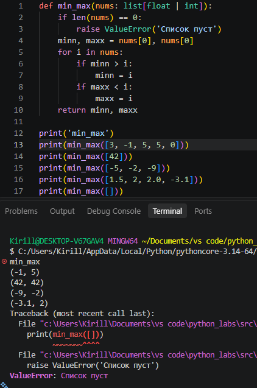
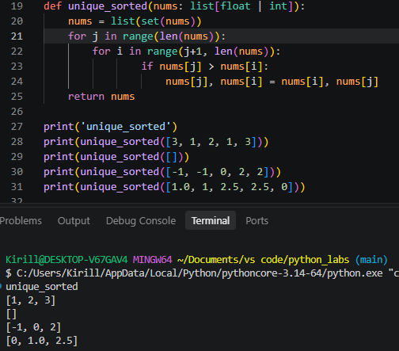
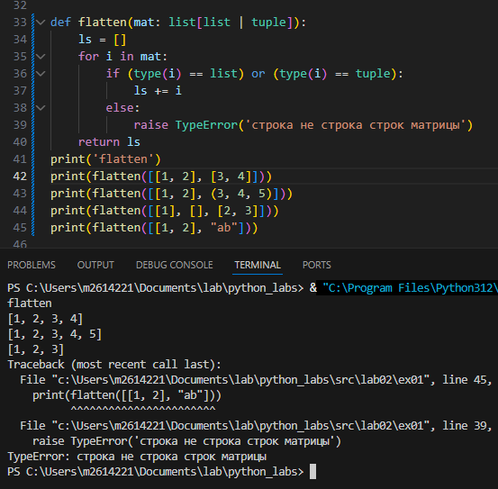
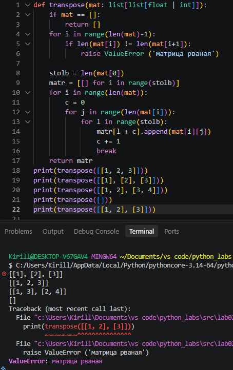
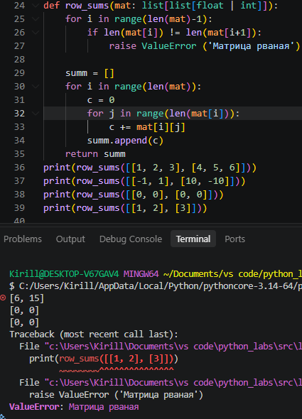
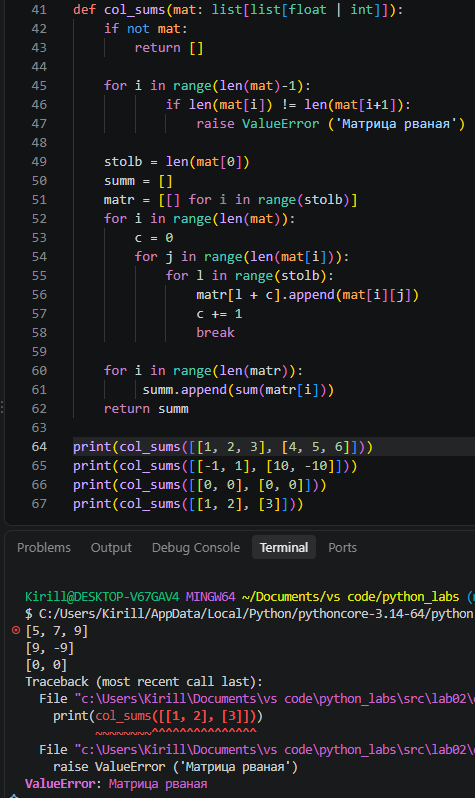
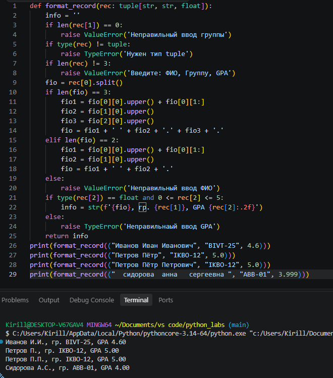

# **Лабораторные работы по Python**

## ***Лабораторная работа №2***

### Задание 1

#### Функция, которая возвращает кортеж с минимум и максимумом списка

# 

#### Функция сортирует список по возрастанию и делает все значения уникальными

# 

#### Функция "Расплющивает" список списков/кортежей в один список.

# 

### Задание B

#### Функция транспонирует матрицу

# 

#### Функция считай сумму по каждой строке

# 

#### Функция считает сумму в каждом столбце

# 

### Задание С

#### Функция определяет тип записи как кортеж, возвращает строку с видоизмененными данными

# 