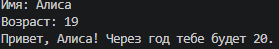
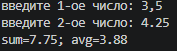
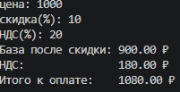

# **Лабораторные работы по Python**

## Задание 1.

Выводит информацию, для вывода используется f-строка.

```python
class human:
    def __init__(self, name, age):
        self.name = name
        self.age = age

id_1 = human(input('Имя: '), int(input('Возраст: ')))
print(f'Привет, {id_1.name}! Через год тебе будет {id_1.age+1}.')
```

# 

## Задание 2.

Вводятся 2 числа, рассчитывается их сумма и среднее арифметическое значение.

```python
nubmer_1 = float(input('введите 1-ое число: ').replace(',', '.'))
nubmer_2 = float(input('введите 2-ое число: ').replace(',', '.'))

print(f'sum={nubmer_2 + nubmer_1:.2f};', f'avg={(nubmer_2+nubmer_1)/2:.2f}')
```

# 

## Задание 3.

Вводятся: цена, скидка, ндс
Выводятся значения: общее после скидки, ндс, итоговая сумма после скидки + ндс

```python
price = float(input('цена: '))
discount = float(input('скидка(%): '))
vat = float(input('НДС(%): '))

base = price * (1 - discount / 100) # цена со скидкой
vat_amount = base * (vat / 100) # ндс
total = base + vat_amount # цена + ндс

print(f'База после скидки: {base:.2f} ₽')
print(f'НДС:               {vat_amount:.2f} ₽')
print(f'Итого к оплате:    {total:.2f} ₽')
```

# 
