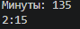
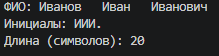
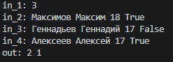
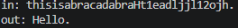

# **Лабораторные работы по Python**

## ***Лабораторная работа №1***

### Задание 1.

Выводит информацию, для вывода используется f-строка.

```python
class human:
    def __init__(self, name, age):
        self.name = name
        self.age = age

id_1 = human(input('Имя: '), int(input('Возраст: ')))
print(f'Привет, {id_1.name}! Через год тебе будет {id_1.age+1}.')
```

# 

### Задание 2.

Вводятся 2 числа, рассчитывается их сумма и среднее арифметическое значение.

```python
nubmer_1 = float(input('введите 1-ое число: ').replace(',', '.'))
nubmer_2 = float(input('введите 2-ое число: ').replace(',', '.'))

print(f'sum={nubmer_2 + nubmer_1:.2f};', f'avg={(nubmer_2+nubmer_1)/2:.2f}')
```

# 

### Задание 3.

Вводятся: цена, скидка, ндс
Выводятся значения: общее после скидки, ндс, итоговая сумма после скидки + ндс

```python
price = float(input('цена: '))
discount = float(input('скидка(%): '))
vat = float(input('НДС(%): '))

base = price * (1 - discount / 100) # цена со скидкой
vat_amount = base * (vat / 100) # ндс
total = base + vat_amount # цена + ндс

print(f'База после скидки: {base:.2f} ₽')
print(f'НДС:               {vat_amount:.2f} ₽')
print(f'Итого к оплате:    {total:.2f} ₽')
```

# 

### Задание 4.

Перевод минут в форма ЧЧ:ММ

```python
m = int(input('Минуты: '))
print(f'{(m//60)}:{m%60:02d}') # d - целое число, 0 - заполняется вместо пустоты ноликом, 2 - сколько заполнять
```

# 

### Задание 5.

Ввод: ФИО
Вывод: ФИО, инициалы, кол-во символов ФИО + пробелы

```python
fio = str(input('Фамилия Имя Отчество: '))

inic = fio.split()
len_fio = len(inic[0]) + len(inic[1]) + len(inic[2]) + 2 # +2 - это 2 пробела, но не понятно нужно ли считать лишние пробелы между ФИО, в задании не считаются, так что пусть будет так

print(f'ФИО: {fio}')
print(f'Инициалы: {inic[0][0]+inic[1][0]+inic[2][0]}.')
print(f'Длина (символов): {len_fio}')
```

# 

### Задание 6.

Получение данных о кол-ве студентов и подсчёт того, сколько студентов приняло участие в очной форме и заочной.

```python
och = 0
zaoch = 0
n = int(input('in_1: ')) # кол-во строк
c = 2 # для in_{c}, чтобы счёт шел по возрастанию


class human:
    def __init__(self, name = str(), age = 0, out = None):
        self.set_data(name, age, out)

    def set_data(self, name, age, out):
        self.name = name
        self.age = age
        self.out = out


while n>0:                        # вводим данные для каждого участника
    name = input('Фамилия Имя: ')
    age = int(input('Возраст: '))
    form = input('очно/заочно? ')

    if form == 'очно':
        form = True
        och += 1
    else:
        form = False
        zaoch += 1

    information = human(name, age, form)
    print(f'in_{c}: {information.name} {information.age} {information.out}')
    c += 1
    n -= 1

print(f'out: {och} {zaoch}')
```

# 

### Задание 7.

Расшифровка изначального слова следующими командами: 
1) Поиск первой заглавной буквы.
2) Нахождение символов расположенных в фиксированном шаге друг от друга.
3) Второй символ стоит сразу после цифры.
4) Последний символ оригинальной строки - "."

```python
flag_Big = False
flag_chis = False
out = '' # изначальная строка
ind_big = 0
ind_chisla = 0
a = str(input('in: ')) # ввод зашифрованного числа

for i in range(len(a)):        # Ищем первую заглавную букву из списка
    if flag_Big == False:      # через флаги находим только одну заглавную букву
        if 'A' <= a[i] <= 'Z':
            flag_Big = True
            out += a[i]
            ind_big = i

for i in range(ind_big+1, len(a)):   # Ищем первую цифру после заглавной
    if flag_chis == False:
        if '0' <= a[i] <= '9':
            flag_chis = True
            ind_chisla = i

different = ind_chisla - ind_big + 1  # сможем найти, через сколько символов стоят числа строки друг от друга, +1 для того чтобы выбрать следущий символ после числа

for i in range(ind_chisla+1, len(a), different): # собирает "изначальную" строку
    out += a[i]
    if a[i] == '.':
        break

print(f'out: {out}')
```

# 
